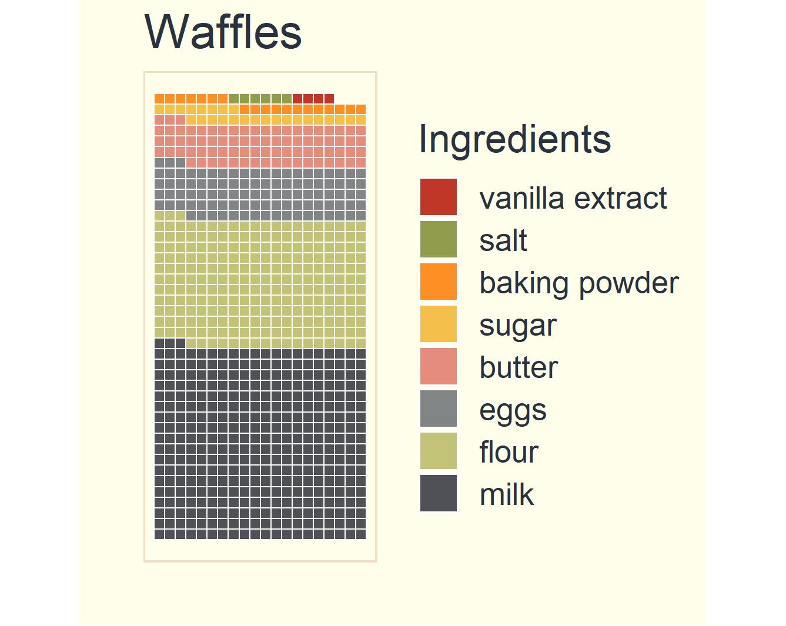
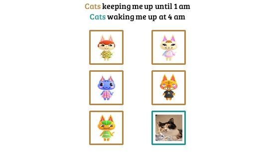
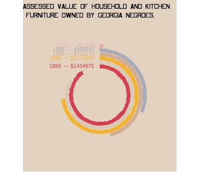
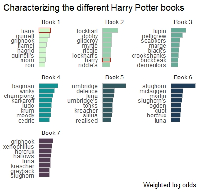
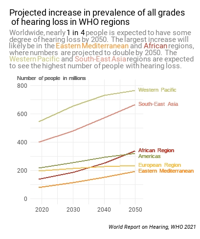
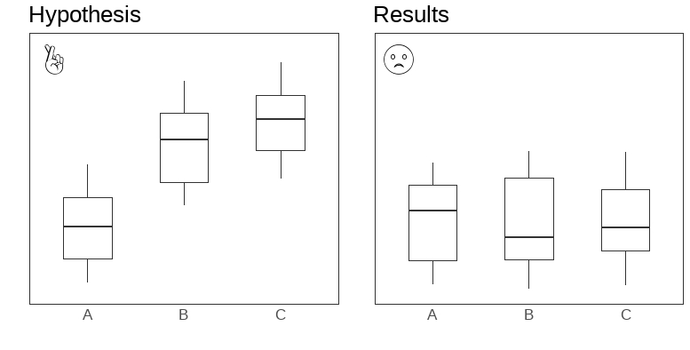
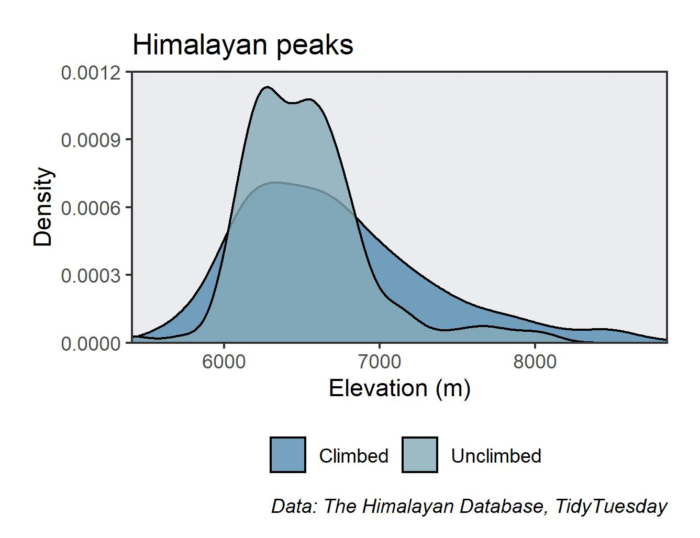
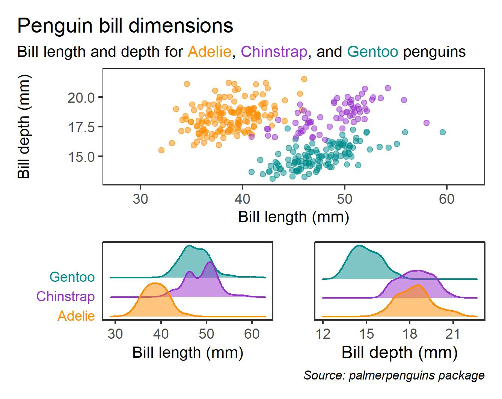
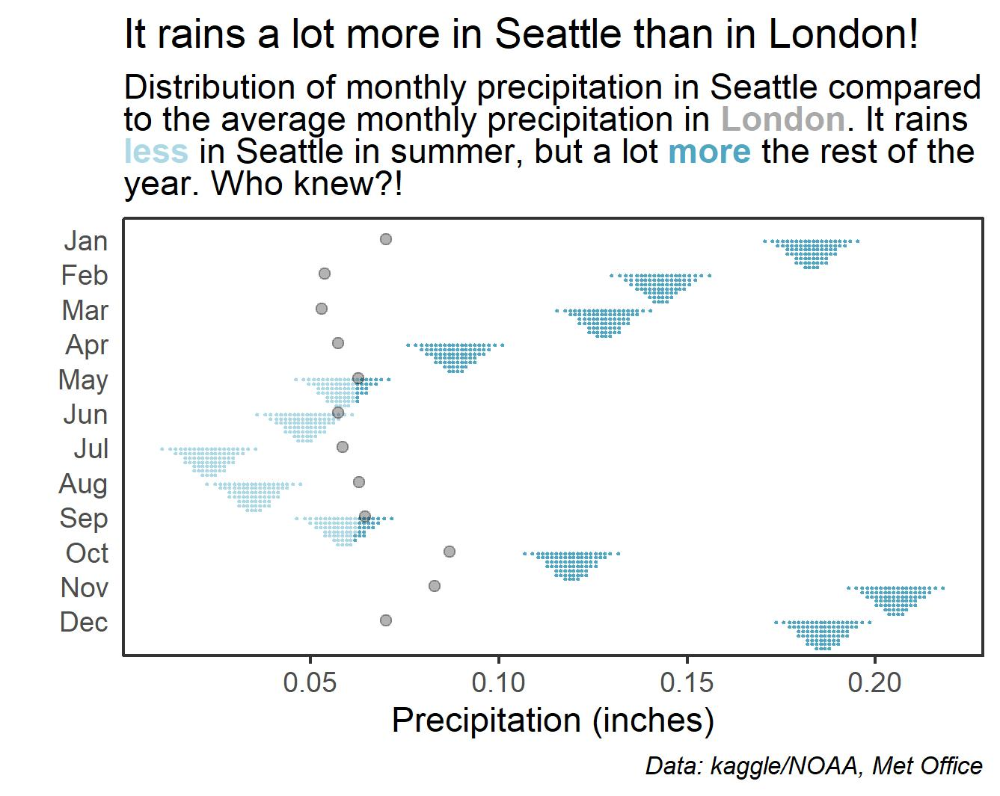

30 Day Chart Challenge
================

My contributions to the
[\#30DayChartChallenge](https://github.com/Z3tt/30DayChartChallenge_2021)

### Day 1: Part to Whole

### Day 2: Pictogram

### Day 3: Historical

### Day 4: Magic

### Day 5: Slope

### Day 6: Experimental

### Day 7: Physical

### Day 8: Animals

### Day 9: Statistics

